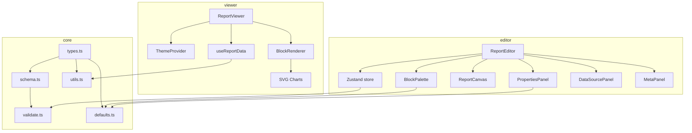
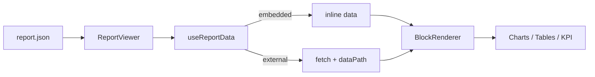

# ReportkitJs — Plan

Embeddable, JSON-described reports for React. Single package `@dmkdev` with three submodules: `core`, `viewer`, `editor`.

## Decisions (confirmed)

| Decision          | Choice                                                                                      |
| ----------------- | ------------------------------------------------------------------------------------------- |
| Package structure | Single package `@dmkdev`, submodules `core` / `viewer` / `editor`                        |
| Data model        | Hybrid: `dataSources` array, each source `embedded` (inline data) or `external` (URL fetch) |
| Block types       | header, text, kpi, table, chart (line/bar/pie), divider, image, section (nested)            |
| Styling           | CSS Modules + CSS variables for theming                                                     |
| Editor            | Visual form-based, drag-and-drop (dnd-kit), auto-generated JSON                             |
| Charts            | Custom SVG (no charting library)                                                            |
| Stack             | Vite, TypeScript, React 18                                                                  |

## Project structure

```
reportkitjsjs/
├── package.json              # exports: ".", "./core", "./viewer", "./editor"
├── tsconfig.json
├── vite.config.ts            # lib mode, multi-entry, vite-plugin-dts
├── vitest.config.ts
├── eslint.config.js
├── .prettierrc
├── src/
│   ├── index.ts              # re-exports core + viewer + editor
│   ├── core/
│   │   ├── index.ts
│   │   ├── types.ts          # TS types for the report JSON schema
│   │   ├── schema.ts         # JSON Schema (draft-07)
│   │   ├── validate.ts       # ajv validation
│   │   ├── defaults.ts       # default block props, default theme
│   │   └── utils.ts          # createId, deepClone, resolveDataPath
│   ├── viewer/
│   │   ├── index.ts
│   │   ├── ReportViewer.tsx
│   │   ├── theme/
│   │   │   ├── ThemeProvider.tsx
│   │   │   ├── useTheme.ts
│   │   │   └── defaultTheme.ts
│   │   ├── blocks/
│   │   │   ├── BlockRenderer.tsx
│   │   │   ├── HeaderBlock.tsx
│   │   │   ├── TextBlock.tsx
│   │   │   ├── KpiBlock.tsx
│   │   │   ├── TableBlock.tsx
│   │   │   ├── ChartBlock.tsx
│   │   │   ├── DividerBlock.tsx
│   │   │   ├── ImageBlock.tsx
│   │   │   └── SectionBlock.tsx
│   │   ├── charts/
│   │   │   ├── LineChart.tsx
│   │   │   ├── BarChart.tsx
│   │   │   ├── PieChart.tsx
│   │   │   ├── ChartTooltip.tsx
│   │   │   ├── ChartLegend.tsx
│   │   │   └── useChartLayout.ts
│   │   ├── hooks/
│   │   │   ├── useReportData.ts
│   │   │   └── useFetch.ts
│   │   └── styles/
│   │       ├── reportViewer.module.css
│   │       ├── blocks.module.css
│   │       └── charts.module.css
│   ├── editor/
│   │   ├── index.ts
│   │   ├── ReportEditor.tsx
│   │   ├── store/
│   │   │   └── editorStore.ts
│   │   ├── panels/
│   │   │   ├── BlockPalette.tsx
│   │   │   ├── PropertiesPanel.tsx
│   │   │   ├── DataSourcePanel.tsx
│   │   │   └── MetaPanel.tsx
│   │   ├── canvas/
│   │   │   ├── ReportCanvas.tsx
│   │   │   ├── BlockWrapper.tsx
│   │   │   └── DropZone.tsx
│   │   ├── forms/
│   │   │   ├── HeaderForm.tsx
│   │   │   ├── TextForm.tsx
│   │   │   ├── KpiForm.tsx
│   │   │   ├── TableForm.tsx
│   │   │   ├── ChartForm.tsx
│   │   │   ├── DividerForm.tsx
│   │   │   ├── ImageForm.tsx
│   │   │   └── SectionForm.tsx
│   │   └── styles/
│   │       ├── reportEditor.module.css
│   │       ├── panels.module.css
│   │       └── canvas.module.css
│   └── demo/
│       ├── main.tsx
│       ├── App.tsx
│       ├── ViewerDemo.tsx
│       ├── EditorDemo.tsx
│       └── sample-report.json
├── tests/
│   ├── core/
│   ├── viewer/
│   └── editor/
├── docs/
│   ├── architecture.md
│   ├── json-schema.md
│   └── api.md
└── README.md
```

## JSON schema (v1.0.0)

```jsonc
{
  "$schema": "https://reportkitjs.dev/schema.json",
  "version": "1.0.0",
  "meta": {
    "id": "uuid",
    "title": "Sales Report Q3 2026",
    "description": "Quarterly sales overview",
    "author": "Analytics Team",
    "createdAt": "2026-09-30T00:00:00Z",
    "updatedAt": "2026-09-30T00:00:00Z",
  },
  "theme": {
    "primaryColor": "#2563eb",
    "fontFamily": "Inter, system-ui, sans-serif",
    "maxWidth": 960,
    "colors": {
      "background": "#ffffff",
      "surface": "#f8fafc",
      "text": "#0f172a",
      "textMuted": "#64748b",
      "border": "#e2e8f0",
      "chart": ["#2563eb", "#10b981", "#f59e0b", "#ef4444", "#8b5cf6"],
    },
  },
  "dataSources": [
    {
      "id": "ds-1",
      "name": "Sales",
      "type": "embedded",
      "data": [
        { "month": "Jan", "revenue": 100, "cost": 60 },
        { "month": "Feb", "revenue": 120, "cost": 70 },
      ],
    },
    {
      "id": "ds-2",
      "name": "Live Sales",
      "type": "external",
      "url": "https://api.example.com/sales",
      "method": "GET",
      "headers": { "Authorization": "Bearer {{token}}" },
      "dataPath": "data.items",
      "refreshInterval": 30000,
    },
  ],
  "blocks": [
    { "id": "b-1", "type": "header", "props": { "text": "Q3 Report", "level": 1 } },
    {
      "id": "b-2",
      "type": "kpi",
      "props": {
        "title": "Revenue",
        "value": { "dataSourceId": "ds-1", "field": "revenue", "aggregation": "sum" },
        "format": "currency",
        "currency": "USD",
        "trend": { "value": 12.5, "direction": "up" },
      },
    },
    {
      "id": "b-3",
      "type": "chart",
      "props": {
        "chartType": "line",
        "dataSourceId": "ds-1",
        "xField": "month",
        "series": [{ "field": "revenue", "label": "Revenue" }],
        "title": "Monthly Revenue",
      },
    },
    {
      "id": "b-4",
      "type": "table",
      "props": {
        "dataSourceId": "ds-1",
        "columns": [
          { "field": "month", "label": "Month" },
          { "field": "revenue", "label": "Revenue", "format": "currency" },
        ],
        "title": "Details",
        "pagination": { "pageSize": 10 },
      },
    },
    {
      "id": "b-5",
      "type": "section",
      "props": {
        "title": "Breakdown",
        "blocks": [/* nested blocks, same shape */],
      },
    },
    { "id": "b-6", "type": "text", "props": { "content": "Markdown **text**", "markdown": true } },
    { "id": "b-7", "type": "divider", "props": { "style": "solid" } },
    {
      "id": "b-8",
      "type": "image",
      "props": { "src": "https://...", "alt": "Chart", "caption": "Fig 1" },
    },
  ],
}
```

### Key schema rules

- **Blocks** reference data via `dataSourceId` (string) — never inline data, except KPI `value` which can be a literal number OR a `{ dataSourceId, field, aggregation }` object.
- **dataSources** are the single source of truth for tabular data. Each is `embedded` (has `data: Record<string, unknown>[]`) or `external` (has `url`, optional `method`, `headers`, `dataPath`, `refreshInterval`).
- **Sections** nest `blocks` recursively (same block shape). Editor supports arbitrary nesting depth.
- **KPI value** aggregation: `sum | avg | count | min | max | last | first`.
- **Number formats**: `number | currency | percent | compact`. Currency uses `currency` field (ISO code).
- **Theme** is optional — falls back to `defaultTheme` when absent.
- **IDs** are UUIDs, generated by `createId()` in core/utils.

## Architecture



### Data flow



### Editor state (Zustand)

```ts
interface EditorState {
  report: Report;
  selectedBlockId: string | null;
  dragState: { blockId: string; from: 'palette' | 'canvas' } | null;
  history: Report[];
  future: Report[];
  // actions
  setReport: (r: Report) => void;
  updateBlock: (id: string, props: Partial<BlockProps>) => void;
  addBlock: (type: BlockType, index: number, sectionId?: string) => void;
  removeBlock: (id: string) => void;
  moveBlock: (id: string, toIndex: number, toSectionId?: string) => void;
  selectBlock: (id: string | null) => void;
  undo: () => void;
  redo: () => void;
  // data source actions
  addDataSource: (ds: DataSource) => void;
  updateDataSource: (id: string, ds: Partial<DataSource>) => void;
  removeDataSource: (id: string) => void;
  // meta actions
  updateMeta: (meta: Partial<ReportMeta>) => void;
  updateTheme: (theme: Partial<ReportTheme>) => void;
}
```

## Build & exports

- Vite lib mode, multi-entry: `index`, `core`, `viewer`, `editor`.
- `vite-plugin-dts` for `.d.ts` generation.
- CSS Modules extracted to `dist/*.css` — consumer imports `@dmkdev/viewer.css` (and `@dmkdev/editor.css` if using editor).
- `package.json` exports map:

```json
{
  "exports": {
    ".": { "types": "./dist/index.d.ts", "import": "./dist/index.js" },
    "./core": { "types": "./dist/core.d.ts", "import": "./dist/core.js" },
    "./viewer": { "types": "./dist/viewer.d.ts", "import": "./dist/viewer.js" },
    "./editor": { "types": "./dist/editor.d.ts", "import": "./dist/editor.js" }
  }
}
```

- Peer deps: `react >= 18`, `react-dom >= 18`.
- Runtime deps: `zustand`, `@dnd-kit/core`, `@dnd-kit/sortable`, `ajv`.

## Usage (consumer)

```tsx
import { ReportViewer } from '@dmkdev/viewer';
import '@dmkdev/viewer.css';
import report from './my-report.json';

function Page() {
  return <ReportViewer report={report} />;
}
```

```tsx
import { ReportEditor } from '@dmkdev/editor';
import '@dmkdev/editor.css';

function EditorPage() {
  const [report, setReport] = useState(initialReport);
  return <ReportEditor report={report} onChange={setReport} />;
}
```

## Testing strategy

- **core**: ajv validation (valid/invalid reports), utils (createId, deepClone, resolveDataPath), defaults.
- **viewer**: render each block type with sample data, chart SVG output (line/bar/pie), theme override, external data fetch (mocked).
- **editor**: store actions (add/remove/move/undo/redo), panel rendering, form updates propagate to store.

## Execution order

1. Project init (Vite, TS, build config, lint, test)
2. core module (types → schema → validate → defaults → utils)
3. Verify build + exports
4. viewer module (theme → ReportViewer → blocks → charts → hooks → styles)
5. editor module (store → ReportEditor → palette → canvas → panels → forms → styles)
6. demo app
7. tests (core → viewer → editor)
8. docs + README
